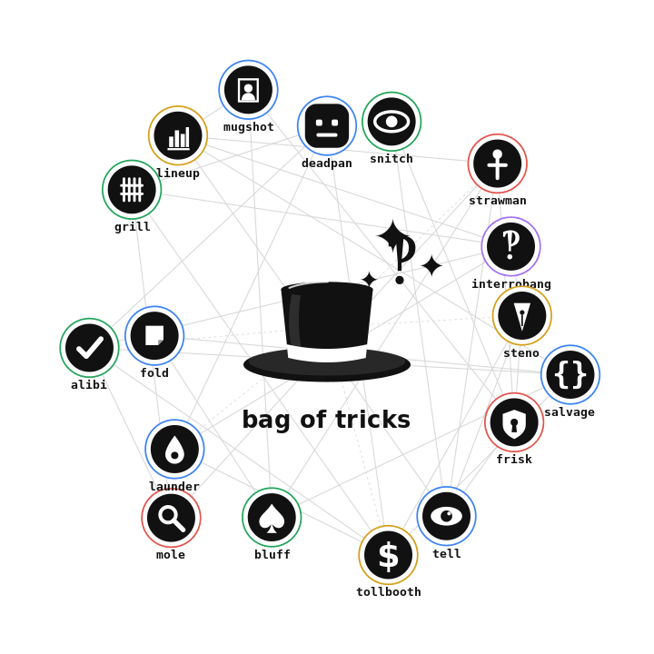

<p align="center">
  
</p>

<p align="center">
  
  <a href="https://github.com/JGalego/Bag-of-Tricks/actions/workflows/ci.yml"></a>
  <a href="LICENSE"></a>
  
  <a href="https://github.com/astral-sh/ruff"></a>
  
</p>

> a small bag of clever hacks for people who work with LLMs all day.

A growing set of single-idea tools. Each lives in its own folder, does one thing, installs in seconds, and has a catchphrase it has to live up to. Inspired in *tone* (not substance) by [caveman](https://github.com/juliusbrussee/caveman) and [headroom](https://github.com/headroomlabs-ai/headroom).

| trick | catchphrase | what it does |
|-------|-------------|--------------|
| [`deadpan`](deadpan/) | *the answer. nothing else.* | strips LLM replies of personality, filler, hedging, emoji, sycophancy. |
| [`snitch`](snitch/) | *see what your agent actually said behind your back.* | a transparent proxy that logs the **exact bytes** your agent sends the model. |
| [`strawman`](strawman/) | *argue with yourself before the internet does.* | red-teams your own prompt — an adversarial model tries to break it and reports where it cracked. |
| [`interrobang`](interrobang/) | *make it ask before it acts.* ‽ | flips the helpful-assistant reflex: ask one sharp question instead of guessing. |
| [`steno`](steno/) | *two letters, and the prompt writes itself.* | mind-numbingly short aliases that expand into full prompts for common dev tasks. |
| [`salvage`](salvage/) | *rip the JSON out of the chatter.* | extracts and repairs valid JSON buried in chatty model output — fences, trailing commas, Python literals. |
| [`frisk`](frisk/) | *pat it down before it ships.* | scans text headed to the model for secrets & PII (keys, tokens, private keys, emails) and redacts or flags them. |
| [`tell`](tell/) | *every AI has a tell.* | flags the giveaways in AI-written prose — "delve", "tapestry", "it's not just X, it's Y", em-dash overuse. |
| [`tollbooth`](tollbooth/) | *know the bill before the bill.* | estimates token count and dollar cost of a prompt across models before you send it. |
| [`bluff`](bluff/) | *call its bluff.* | extracts the URLs & citations from an answer and checks they actually resolve — catching hallucinated links. |
| [`mole`](mole/) | *find the plant.* | sniffs untrusted input for planted / injected instructions before they reach the model — frisk for what comes *in*. |
| [`launder`](launder/) | *wash out the prints.* | strips the mechanical fingerprints from text — zero-width chars, smart quotes, exotic spaces, em-dash tics. |
| [`alibi`](alibi/) | *does the story check out?* | flags answer claims that aren't supported by the provided sources — a lexical grounding check for RAG. |
| [`fold`](fold/) | *know when to fold.* | catches overconfident phrasing and absolutes so the model hedges or abstains instead of bluffing. |
| [`grill`](grill/) | *put it in the hot seat.* | adversarially interrogates an answer with probing follow-ups before you trust it. |
| [`lineup`](lineup/) | *same prompt, the whole lineup.* | runs one prompt across several models and lays the answers side by side. |
| [`mugshot`](mugshot/) | *we know your prints.* | guesses which model wrote a passage from its stylistic fingerprints — a parlor trick, not proof. |
| [`combo`](combo/) | *pull the whole routine.* | chains tricks into one pipeline so the output of one flows into the next — the bag's composition layer. |

## composing tricks

Every trick is a `stdin->stdout` program, so the composition layer is just the
**Unix pipe** — tricks chain with `|` out of the box:

```bash
# redact secrets, wash the typographic prints, strip the personality
cat reply.md | frisk | launder | deadpan
```

[`combo`](combo/) makes that a single call (and a [skill](combo/SKILL.md), so
Claude Code can run a composed routine in one shot rather than invoking each
trick separately):

```bash
combo "frisk --pii | launder | deadpan" < reply.md
combo --list          # every trick, tagged by shape
```

A trick's **shape** tells you where it can sit in a routine:

| shape        | emits                  | where it sits     | examples                                       |
|--------------|------------------------|-------------------|------------------------------------------------|
| **filter**   | transformed text       | the middle        | `frisk` `launder` `salvage` `mole` `deadpan`   |
| **analyzer** | a report / verdict     | the end (a sink)  | `tell` `fold` `alibi` `mugshot` `bluff` `tollbooth` |
| **gate**     | nothing (an exit code) | first or last     | a `--check` / `--max` *mode*, not a trick      |

Rule of thumb: any number of **filters**, optionally ended by **one analyzer**,
optionally fronted or closed by a **gate** (`--check` / `--max`, exposed by
`frisk`, `launder`, `mole`, `fold`, `alibi`, `tell`, …) that aborts the routine:

```bash
# refuse to continue if a secret is present, then wash the rest
combo "frisk --check | launder" < draft.md && echo "shipped clean"
```

> **Is there a *native* way for Claude Code to pipe skills?** No — skills are
> invoked one at a time; there's no `skill1 | skill2` syntax. The native options
> are to invoke skills in sequence (model-driven) or write a meta-skill that
> orchestrates them. For this bag the composition substrate is the shell pipe,
> and `combo` is the meta-skill that wraps it.

## the philosophy

Caveman cuts *tokens*. Headroom compresses *context*. This bag is about everything *else* that's annoying when you build with LLMs: they're chatty, they hide their prompts, they're easy to break, they guess when they should ask — and whatever the next annoyance turns out to be. Each trick takes on exactly one of them. New tricks get added as the irritations pile up.

Everything here is Python 3.9+, mostly standard library — most tricks have **zero dependencies** (`bluff` even checks links with nothing but `urllib`). A few reach further: `strawman`, `grill`, and `lineup` use the [`anthropic`](https://github.com/anthropics/anthropic-sdk-python) SDK to actually call a model (each has a `--dry-run` that needs nothing), and `tollbooth` *optionally* uses [`tiktoken`](https://github.com/openai/tiktoken) for exact token counts, falling back to a built-in heuristic when it's absent.

```bash
git clone <this repo>
cd bag-of-tricks

# try the cheapest trick first — no API key needed
echo "Certainly! I'd be happy to help. Here is the answer: 42 🎉" | python3 deadpan/deadpan.py
# -> The answer: 42
```

Each folder has its own README with the full pitch and usage.

## prerequisites

Everything here runs on **Python 3.9+** — that's the only hard requirement, and most tricks need nothing more (many are pure standard library). Check with `python3 --version`. This matters in every mode: even as a Claude Code plugin, the CLIs run on the Bash tool's `PATH`, so Python has to be available in that environment too.

A few tricks reach further, and each one tells you when:

- **Calling a model** — `strawman`, `grill`, `lineup`, and `steno --run` use the [`anthropic`](https://github.com/anthropics/anthropic-sdk-python) SDK and an `ANTHROPIC_API_KEY` (`pip install anthropic`). Each has a `--dry-run` / no-key path so you can try it without either.
- **`tollbooth`** *optionally* uses [`tiktoken`](https://github.com/openai/tiktoken) for exact token counts (`pip install tiktoken`); without it, it falls back to a built-in heuristic.
- The standalone install below needs [`just`](https://github.com/casey/just). The plugin and `python3 <trick>/<trick>.py` paths don't.

## quick install (one line)

Grab the whole bag — no clone, no `just`. Downloads the repo, then symlinks every trick's CLI into `~/.local/bin` and its `SKILL.md` into `~/.claude/skills/`:

```bash
curl -fsSL https://raw.githubusercontent.com/JGalego/Bag-of-Tricks/main/install.sh | bash
```

It discovers tricks by scanning the tree, so it always installs the full set. Knobs: `BIN_DIR`, `BOT_HOME`, `BOT_REF` (branch/tag), `BOT_SKILLS`. Make sure `~/.local/bin` is on your `PATH`.

Want just one trick? Grab a single folder as a zip — `just pack frisk` (writes `dist/frisk.zip`), or download it straight from GitHub via [download-directory.github.io](https://download-directory.github.io/?url=https://github.com/JGalego/Bag-of-Tricks/tree/main/frisk). `just pack` with no args zips every trick plus the whole bag.

## install standalone

Prefer plain CLIs and skills without the plugin system? Recipes run with [`just`](https://github.com/casey/just). Installing a trick symlinks its CLI into `~/.local/bin` and its `SKILL.md` into `~/.claude/skills/`:

```bash
just install                   # install every trick
just install deadpan           # just one
just install snitch strawman   # or a few
just uninstall                 # remove them all (or name them)
```

Then run them by name (make sure `~/.local/bin` is on your `PATH`):

```bash
echo "Sure! 42 🎉" | deadpan
```

Prefer not to install? Every trick also runs straight from its folder, e.g. `python3 deadpan/deadpan.py`.

## use as a Claude Code plugin

The bag is a [plugin marketplace](https://code.claude.com/docs/en/plugin-marketplaces): each trick is a [plugin](https://code.claude.com/docs/en/plugins) that ships its skill **and** puts its CLI on the Bash tool's `PATH` while enabled — no separate install step.

```bash
# add the marketplace, then install the tricks you want
/plugin marketplace add JGalego/Bag-of-Tricks
/plugin install snitch@bag-of-tricks
/plugin install deadpan@bag-of-tricks
```

Want to try it before publishing? Load a plugin straight from a checkout:

```bash
claude --plugin-dir ./snitch
```

Plugin skills are namespaced (`/deadpan:deadpan`, `/strawman:strawman`, …), and each plugin's CLI (`snitch`, `steno`, …) is runnable while the plugin is enabled.

## windows

The tricks are pure Python and run anywhere; only the plumbing assumes a Unix
shell.

- **As a Claude Code plugin** — works as-is. Claude Code's Bash tool runs in a bash environment (Git Bash / WSL) on Windows too, so the `bin/` wrappers and the `python3 …` calls in each `SKILL.md` resolve fine.
- **Standalone** — the `just install` recipe symlinks into `~/.local/bin`, so run it from **WSL or Git Bash** rather than PowerShell/cmd. Or skip install and run a trick directly: `python3 deadpan\deadpan.py`.
- If `python3` isn't found, use `python` or the `py` launcher (`py -3`).

## development

Quality is enforced with [ruff](https://docs.astral.sh/ruff/) (lint + format) and [pytest](https://docs.pytest.org/) — each trick has a `test_<trick>.py` beside it. Everything runs with no network and no API key (`strawman`'s tests stub the SDK).

```bash
just dev          # pip install -r requirements-dev.txt (ruff + pytest)
just check        # what CI runs: ruff check + ruff format --check + pytest
just fmt          # auto-format
just test         # just the tests
just              # list every recipe
```

Or directly: `ruff check .`, `ruff format .`, `pytest`. A [Makefile](Makefile) mirrors the dev recipes (`make check`, `make dev`, …) if you'd rather use [make](https://www.gnu.org/software/make/).

CI runs the same checks on every push and PR across Python 3.9–3.12 (see [.github/workflows/ci.yml](.github/workflows/ci.yml)).

## inspirational quote

> "I'm not excited by what AI can do. **I'm excited by what I can do.**"
>
> -- Kelsey Hightower

## license

MIT — see [LICENSE](LICENSE). Use them, fork them, rename them, put them in your own bag.
