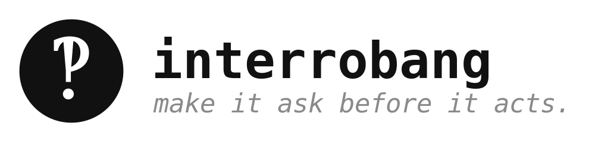

<p align="center">
  
</p>

An LLM's default reflex is to be helpful by answering *now*. When the request is
underspecified, "answer now" quietly becomes "guess now" — and you find out it
guessed wrong three steps later. interrobang flips the reflex: when ambiguity
would change what it does, fire **one** sharp clarifying question first.

The whole brand is the glyph: ‽ (U+203D, the interrobang — a question and an
exclamation in one mark). Ask, decisively.

> Install with [`just`](https://github.com/casey/just): `just install interrobang`
> symlinks the `interrobang` CLI onto your `PATH` and drops the
> [skill](https://docs.claude.com/en/docs/agents-and-tools/skills) into
> `~/.claude/skills/`. Or run `python3 interrobang.py` from this folder.

## two modes, zero dependencies

### 1. install the reflex

```bash
python3 interrobang.py prompt
```

Prints a system-prompt addendum. Prepend it to your agent's system prompt and it
will ask-before-guessing — *and*, just as importantly, **not** ask when there's
an obvious answer or a safe default. (The skill version is in `SKILL.md` for
Claude Code / agent skill setups.)

```bash
# wire it into a prompt file
python3 interrobang.py prompt > _ask.md
cat _ask.md my_system_prompt.txt > system.txt
```

### 2. catch the guesses after the fact

```bash
python3 interrobang.py check response.txt
cat transcript.txt | python3 interrobang.py check
```

Lints text for the linguistic fingerprint of a guess that should have been a
question — "I'll assume…", "presumably…", "I'll go with…", "defaulting to…":

```
‽ 2 likely guess(es) — should it have asked instead?

  L4  …I'll assume…
        I'll assume you mean the production database and drop the table.
  L9  …defaulting to…
        Defaulting to UTC since no timezone was given.

(1 question mark(s) total — did it ask, or just assume?)
```

Exits non-zero when it finds guesses, so you can gate a review step on it.

#### your own guess phrases — `--patterns`

The built-in regexes catch the obvious tells. Add your own with `--patterns`
(repeatable), pointing at a JSON file shaped:

```json
{ "patterns": ["\\byolo it\\b", "\\bclose enough\\b"] }
```

Each regex is **merged into** the built-ins and compiled case-insensitively.

```bash
python3 interrobang.py check response.txt --patterns house_style.json
```

You can also set `INTERROBANG_PATTERNS` (an `os.pathsep`-separated list of JSON
paths) as a fallback when `--patterns` isn't passed.

#### semantic guesses — `--llm`

Regexes only see phrases. A model sees *intent* — it catches the guesses that
wear no tell-tale wording: silently picking a default, quietly resolving an
ambiguity, answering a question the user never pinned down.

```bash
python3 interrobang.py check response.txt --llm
python3 interrobang.py check response.txt --llm --provider openai --model gpt-4o-mini
```

`--llm` reads the transcript with a model (Anthropic / OpenAI / Gemini via the
shared helper) and reports the same `‽`-flagged lines; `--provider` and
`--model` pick the backend. Needs an API key in the environment; exits `2` if
the provider call fails. (`--patterns` applies to the offline check only.)

## the philosophy

interrobang is **not** "ask more questions." A bot that asks five questions
before every task is as useless as one that guesses every time. It's about
*calibration*: ask the one question that matters, take the sane default
otherwise, and say which you did.

> One sharp question beats five paragraphs built on a wrong assumption.
