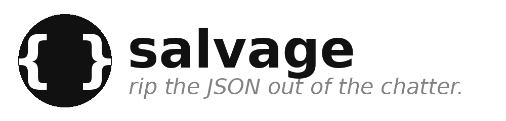

<p align="center">
  
</p>

You asked for JSON. The model gave you a warm greeting, a ```json fence, a
trailing comma it learned from JavaScript, a `True` it learned from Python, and
a polite "let me know if you need anything else!". Your parser gave you a
stack trace. **salvage** rips the clean JSON out of the chatter.

It comes in two halves:

- **`SKILL.md`** — a [Claude Code / agent skill](https://docs.claude.com/en/docs/agents-and-tools/skills)
  that tells the model: when something downstream needs strict JSON, find the
  one valid value in the blob and emit *only* that — no fence, no preamble.
- **`salvage.py`** — a zero-dependency stdin->stdout filter that does the same
  mechanically to text that *already exists* (a model reply, a log line, a
  pasted transcript). Pipe anything through it.

## the filter

```bash
echo 'Sure! ```json
{"name": "Ada", "active": True,}
```' | python3 salvage.py
# -> {
#      "name": "Ada",
#      "active": true
#    }

# one-liner for pipelines
echo 'result: {"ok": true} done' | python3 salvage.py --compact
# -> {"ok":true}

# just show me what you found, don't touch it
echo 'blah {"a": None,} blah' | python3 salvage.py --extract-only
# -> {"a": None,}
```

### what it repairs

| damage                         | example            | becomes        |
|--------------------------------|--------------------|----------------|
| markdown fences                | ```` ```json … ``` ```` | the contents   |
| prose before/after             | `here: {…} thanks` | the `{…}`      |
| trailing commas                | `{"a":1,}`         | `{"a":1}`      |
| `//` and `/* */` comments      | `{"a":1 /* x */}`  | `{"a":1}`      |
| Python literals                | `True/False/None`  | `true/false/null` |
| smart quotes                   | `“a”: “b”`         | `"a": "b"`     |

Braces and brackets *inside* string values are left alone — balancing tracks
in-string state and backslash escapes, so `{"note": "use {this}"}` stays whole.

### flags

| flag             | does                                            |
|------------------|-------------------------------------------------|
| `-c`/`--compact` | one-line output (no indentation)                |
| `--indent N`     | indent width for pretty output (default `2`)    |
| `--extract-only` | locate the JSON substring but don't repair it   |
| `--patterns FILE`| merge custom repair tables (repeatable)         |

Unsalvageable input writes a short note to stderr and exits `1`.

### custom patterns

The built-in repair tables cover the *common* damage. If your source has its
own quirks — guillemet quotes `«»`, a non-Python literal like `Nil` — extend
the tables with a JSON file via `--patterns FILE` (repeatable) or the
`SALVAGE_PATTERNS` env var (`os.pathsep`-separated paths, used when the flag is
absent). User entries **merge into** the built-ins and override on collision;
the built-ins stay the base.

```json
{
  "smart_quotes": {"«": "\"", "»": "\""},
  "py_literals": {"Nil": "null", "TRUE": "true"}
}
```

- `smart_quotes` maps any character to its replacement, applied before parsing
  (so it can fix string boundaries) — same machinery as the built-in `“ ” ‘ ’`.
- `py_literals` maps a bare token to its JSON value. The token is matched as a
  whole word *outside* strings only; the literal regex is rebuilt from the
  merged keys, so `Nil` becomes recognized alongside `True`/`False`/`None`.

```bash
echo '{«key»: Nil}' | python3 salvage.py --patterns mine.json --compact
# -> {"key":null}

SALVAGE_PATTERNS=mine.json python3 salvage.py reply.txt
```

## install

From the repo root, [`just`](https://github.com/casey/just) symlinks the CLI onto
your `PATH` and the [skill](https://docs.claude.com/en/docs/agents-and-tools/skills)
into `~/.claude/skills/`:

```bash
just install salvage
echo 'ok: {"x": 1,}' | salvage --compact
# -> {"x":1}
```

Or run it in place: `python3 salvage.py`.

## use them together

Skill at generation time (the model emits clean JSON) + filter at the boundary
(whatever leaks gets cleaned anyway). Belt and suspenders for anyone who's ever
fed `json.loads` a sentence.

## not a parser-fixer

salvage handles the *common* LLM damage, not arbitrary broken JSON. If the
value can't be recovered after repair, it says so and exits non-zero — it won't
hallucinate a structure to make the error go away.
