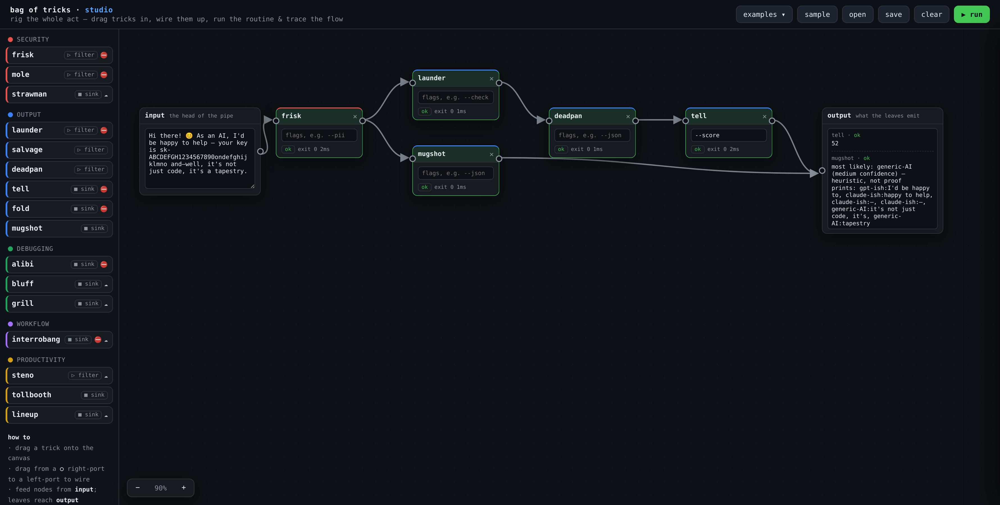
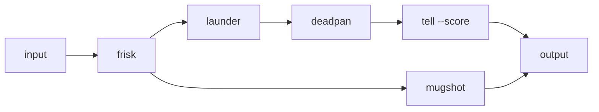
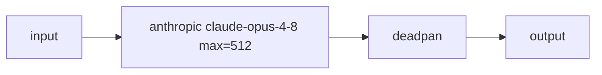

# studio

**rig the whole act.**



A magician rehearses the act in the studio before the show: lay the tricks out,
wire them together, run it, and watch where it breaks. This is that, for the bag
— a browser editor where you drag tricks onto a canvas, connect them with
arrows into a branching routine, run it, and **trace the data** as it flows
through, stage by stage.

It's the visual, multi-branch cousin of [`combo`](../combo). Where combo is one
straight Unix pipe (`frisk | launder | tell`), studio lets a stage **fan out** —
one trick's output feeding several downstream branches — so you can compare
routines side by side. Each node still takes a **single input** (one arrow in),
which keeps the data flow unambiguous, exactly like a pipe.

```bash
python studio/server.py            # serve on http://127.0.0.1:8765
python studio/server.py --open     # …and open a browser
just studio                        # same, via the task runner
```

Then, in the browser:

- **drag** a trick — or an **✦ LLM model** (Anthropic / OpenAI / Gemini) — from
  the left palette onto the canvas,
- **wire** it up: drag from a node's right port (`○`) to another node's left
  port — feed nodes from the **input** box; leaves reach the **output** box,
- **▶ run** the routine,
- **hover** a node to trace its path back to the input; **click** a node to open
  its stdout, summary, exit code, and timing,
- **zoom** with the on-canvas `− / + ` control (click the percentage to reset),
  or `Ctrl`/`⌘` + scroll to zoom toward the cursor.

Hit **examples** for ready-made routines (see below), **sample** for a quick
branching demo, **save** to download the pipeline, and **open** (or drop a file
on the canvas) to load one back. There are **no coordinates in the file** — the
DAG is auto-laid-out left-to-right on load.

## The pipeline format (Markdown + Mermaid)

A saved pipeline is a plain Markdown file: a title, a description, a
[Mermaid](https://mermaid.js.org/) `flowchart` for the graph, and a `text` block
for the sample input. It renders as a real diagram on GitHub, and it's easy to
hand-write:

````markdown
# Clean, then score

Redact, wash, strip personality, then score how AI it reads.



```text
Hi there! As an AI, your key is sk-… it's a tapestry.
```
````

Rules of the graph:

- `input` and `output` are reserved node ids — the head of the pipe and the sink.
- A node id is the trick name; **flags go in a label**: `tell["tell --score"]`.
  For a second node of the same trick, use a distinct id with a label, e.g.
  `f2["frisk --check"]`.
- **Fan-out** is just one node pointing at several: `frisk --> launder` and
  `frisk --> mugshot` share the same `frisk`.
- Each trick takes a **single input** (one arrow in); `output` is the exception
  and collects every leaf.

Coordinates aren't stored, so editing the file or reordering lines never breaks
the layout. (Legacy `.json` pipelines from earlier versions still open — their
positions are ignored and the graph is re-laid-out.)

## Examples

The **examples** dropdown is populated from `studio/examples/*.md`. They all run
offline:

- **Clean, then score** — `frisk → launder → deadpan → tell`, with a `mugshot`
  branch off `frisk`. The flagship fan-out.
- **Gate on secrets** — `frisk --check → launder`. The gate trips on a secret
  and the branch is skipped; clear the key from the input and it goes green.
- **Redact, then rip out the JSON** — `frisk → salvage`. Redact the secret
  before the parser sees it, then extract the JSON from the chatter.
- **Fan-out audit** — `launder` fans out to `tell`, `mugshot`, and `fold` at
  once: one input, audited three ways. (This is the shape `combo` can't do.)
- **Ask a model, then strip the fluff** — an Anthropic LLM node answers the
  prompt, then `deadpan` + `tell` clean and score it. (Needs `ANTHROPIC_API_KEY`.)

Drop a new `.md` into that folder and it shows up in the menu after a reload.

## How it runs the tricks

Every trick in the bag is a `stdin → stdout` program with a `main(argv)`. studio
runs each node **in-process**: it imports the sibling trick module once and calls
`main()` with `sys.stdin`/`sys.stdout` redirected to in-memory buffers — no
subprocess, no shell, just a function call with captured streams and the trick's
own exit code. A per-node timeout (default 20s) guards the network tricks.

- **fan-out** — a node's output is fed to *every* node it points at.
- **single input** — each node has at most one incoming arrow (the UI enforces
  it; a new wire replaces the old one).
- **gates abort branches** — if a node exits non-zero (a `--check`/`--max` gate
  that tripped, or a failure), its descendants are marked `skip` and that branch
  stops — just like a gate aborting a `combo` pipeline.
- **leaves are outputs** — any live node with no outgoing wire (or one wired to
  the **output** box) shows its result in the output box.

## LLM nodes

Beyond the tricks, the palette's **✦ models** section has LLM provider nodes —
**Anthropic**, **OpenAI**, **Azure OpenAI**, and **Gemini**. An LLM node is a
filter: it takes whatever flows in as the **prompt**, calls the model, and emits
the completion downstream. Drag one in, type/pick the **model** (for Azure, your
**deployment name**), and edit the **inference params** (temperature, max tokens,
top_p) right on the box. They're styled distinctly — a coloured glow and a ✦ — so
they don't read like the single-purpose tricks.

Calls run in-process via the official SDKs (`anthropic`, `openai`,
`google-genai`) with a 90s per-node timeout. Each provider reads its credentials
from the environment:

| Provider     | credentials                                          | default model      | install                    |
|--------------|------------------------------------------------------|--------------------|----------------------------|
| Anthropic    | `ANTHROPIC_API_KEY`                                  | `claude-opus-4-8`  | `pip install anthropic`    |
| OpenAI       | `OPENAI_API_KEY`                                     | `gpt-4o`           | `pip install openai`       |
| Azure OpenAI | `AZURE_OPENAI_API_KEY` + `AZURE_OPENAI_ENDPOINT` (opt. `AZURE_OPENAI_API_VERSION`) | your deployment | `pip install openai` |
| Gemini       | `GEMINI_API_KEY` (or `GOOGLE_API_KEY`)               | `gemini-2.0-flash` | `pip install google-genai` |

**`.env` files.** On startup the server loads `.env` from the repo root, `studio/`,
and the working directory (a real environment variable always wins). Drop your
keys in a `.env` and they're picked up — no exporting required. (`.env` is
gitignored.)

**No credentials → disabled.** A provider whose credentials aren't found anywhere
is shown **greyed and locked (🔒)** in the palette — you can't drag it until you
set its keys. The startup log prints which providers are enabled. A missing key
or SDK at run time still surfaces as a node `error` (its branch is skipped), not
a crash. On models that reject sampling params — Opus 4.8 / 4.7 and Fable 5 —
`temperature`/`top_p` are dropped automatically so the call doesn't 400.

In the Markdown/Mermaid file an LLM node is a labelled node whose first word is
the provider: `id["anthropic claude-opus-4-8 temp=0.7 max=512"]`
(`temp`→temperature, `max`→max_tokens). For example:



## What's in the palette

Every trick except `combo` (the studio *is* the chainer) and `snitch` (a
long-running proxy server), plus the three LLM provider nodes above. Tricks are
grouped by **category** and tagged by **shape**:

- **▷ filter** — emits transformed text, chains in the middle:
  `frisk`, `launder`, `salvage`, `mole`, `deadpan`, `steno`.
- **■ sink** — emits a report/verdict, a terminal stage:
  `tell`, `fold`, `alibi`, `mugshot`, `squeeze`, `tollbooth`, `bluff`, `grill`,
  `lineup`, `strawman`, `interrobang`.

Two more markers: **⛔** the trick has a gate mode (`--check`) that can abort its
branch; **☁** the trick calls a model / the network, so it's slow and may need
an API key.

## Logs

The server logs to stderr, **color-coded**: cyan `http` lines (status code green
/ yellow / red), a magenta `run` header per pipeline, one line per node tinted by
status (`ok` green, `abort`/`error` red, `timeout` yellow, `skip` grey — matching
the node tints in the editor), an `→ calling provider:model …` hint before each
(possibly slow) LLM call, and a colored `done` summary. Color auto-disables when
stderr isn't a TTY or `NO_COLOR` is set, so piped/captured output stays plain.

```
17:07:07   run  run · 3 node(s), 1 edge(s)
  abort   frisk    2ms  [frisk] 1 found: 1×openai_key
  skip    launder       upstream a did not pass
17:07:07   run  done · 1 abort, 1 skip
```

## Endpoints

`server.py` is a dependency-free stdlib HTTP server:

| route           | method | does                                                        |
|-----------------|--------|-------------------------------------------------------------|
| `/`             | GET    | the editor (`index.html`)                                   |
| `/api/tricks`   | GET    | the catalog — every runnable trick, by category and shape   |
| `/api/examples` | GET    | the example pipelines from `examples/*.md` (title + doc)    |
| `/api/run`      | POST   | execute a routine; returns per-node output, status, timing  |

(The HTTP API still speaks JSON — only the saved *file* format is Markdown.)

`POST /api/run` takes `{input, nodes:[{id,trick,flags}], edges:[{source,target}]}`
and returns `{nodes:{id:result}, outputs:[…], order:[…]}`. Per-node `status` is
one of `ok`, `abort` (non-zero exit), `skip` (upstream didn't pass), `timeout`,
or `error`.
