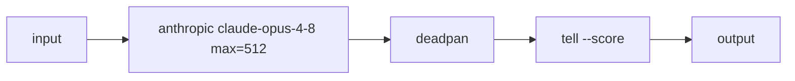

# Ask a model, then strip the fluff

An LLM node pipes its input in as the prompt and emits the completion — here an
Anthropic model answers, deadpan strips the personality, and tell scores how AI
it still reads. **Needs ANTHROPIC_API_KEY** (swap the node for openai/gemini and
set that provider's key instead).



```text
In two sentences, explain what a Unix pipe is and why it's an elegant idea.
```
