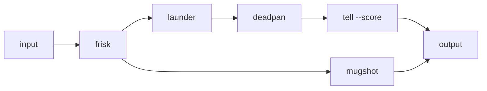

# Clean, then score

Redact secrets, wash typographic prints, strip personality, then measure how AI
the prose still reads — with a mugshot branch that profiles the original.



```text
Hi there! 😊 As an AI, I'd be happy to help — your key is sk-ABCDEFGH1234567890ondefghijklmno and—well, it's not just code, it's a tapestry.
```
