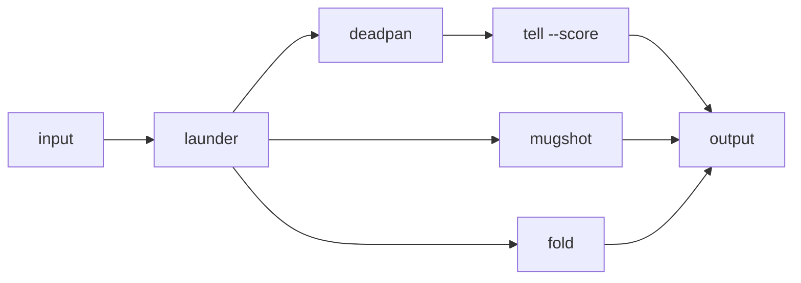

# Fan-out audit

One cleaned input, audited three ways at once: launder washes the prints, then
the result fans out to tell (AI-smell score), mugshot (who wrote it?), and fold
(overconfidence). The branching is the whole point of studio — combo can't.



```text
Honestly, this is definitely the best approach and it will always work — trust me, everyone knows that. As an AI, I'd say it's not just fast, it's a paradigm shift. 🚀
```
