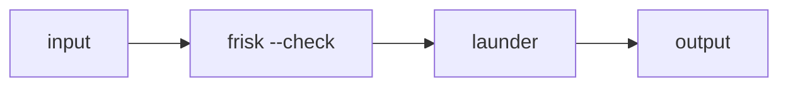

# Gate on secrets

frisk --check is a gate: a secret makes it exit non-zero and abort the branch,
so launder is skipped. Run it, then delete the key from the input and run again
to watch the branch go green.



```text
Please deploy with this token: sk-ABCDEFGH1234567890ondefghijklmno — and let me know how it goes.
```
