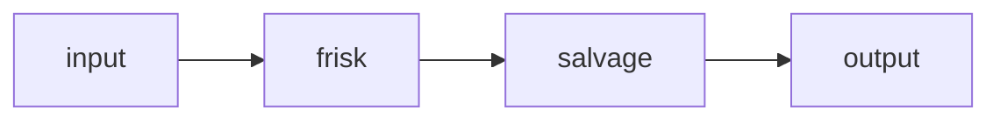

# Redact, then rip out the JSON

A chatty model reply wraps a JSON blob that contains a secret. frisk redacts the
secret first (so it never reaches the parser), then salvage extracts and
pretty-prints the JSON out of the surrounding chatter.



````text
Sure! Here's the config you asked for:
```json
{ "api_key": "sk-ABCDEFGH1234567890ondefghijklmno", "owner": "ada@example.com", "retries": 3 }
```
Let me know if you need anything else!
````
